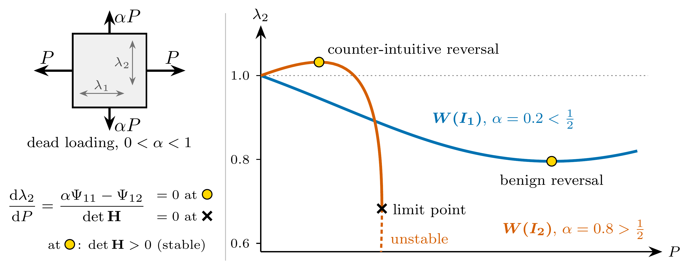

# Stable stretch reversal in the biaxial tension of isotropic hyperelastic membranes

Code accompanying J. Ciambella, *Stable stretch reversal in the biaxial tension
of isotropic hyperelastic membranes*, Proc. R. Soc. A (manuscript RSPA-2026-0707).
The numerical and symbolic procedures are described in the electronic
supplementary material (ESM) of the article.

<p align="center">
  
</p>

## The paper in brief

Stretch a rubber sheet by dead loads $P$ and $\alpha P$ with $0\le\alpha<1$, and
the transverse stretch $\lambda_2$ need not follow the load. It can stop, turn
and run backwards while the load, and even the transverse stress itself, keep
increasing. This *stretch reversal* takes place on a stable branch, where the
membrane is a strict local energy minimiser, and not at an instability.

- **One exact condition.** A reversal occurs exactly when the ratio of plane-stress
  moduli $r=\Psi_{12}/\Psi_{11}$ equals $\alpha$. Since $r=1/2$ in the undeformed
  state, the sign of $\alpha-1/2$ fixes the initial response.
- **A kinematic fingerprint of the material.** For single-invariant energies the
  loading path and the reversal state are universal. $W(I_1)$ reverses if and
  only if $0<\alpha<1/2$, with $\lambda_2$ passing through a minimum. $W(I_2)$
  reverses if and only if $1/2<\alpha<1$, with $\lambda_2$ decreasing while its
  own stress grows. Which reversal is seen identifies the constitutive class from
  stretch measurements alone, with no force measured.
- **Counting and the large-strain limit.** The parity of the number of reversals
  is fixed by the state the membrane ends in at large strain: it either keeps
  spreading, with $\lambda_2/\lambda_1\to\alpha$, or collapses into a fibre,
  with $\lambda_2\to0$. The choice between the two is set by the relative
  strength of the second invariant.
- **The precursor of a classical instability.** As $\alpha\to1$ the reversal
  condition degenerates into the Treloar–Kearsley symmetry-breaking bifurcation of
  the equibiaxial sheet; for $\alpha<1$ the load imbalance unfolds that
  singularity into an ordinary, stable reversal.

## The code

All scripts are pure Python (NumPy/SciPy/SymPy/mpmath/Matplotlib); no
finite-element library is needed. Each script writes its output to the current
directory.

### Installation

```bash
pip install -r requirements.txt
```

### Reproducing the paper

| Output in the paper | Command | Output file(s) |
|---|---|---|
| Figs 1, 2, 5 | `python3 make_figures.py` | `fig1_reversal_paths.pdf`, `fig2a_universal_with_detH.pdf` (Fig. 2), `fig3_census_terminal.pdf` (Fig. 5) |
| Fig. 3 | `python3 biaxial_equilibrium_mapper.py --material constant --alpha 0.70 --plot` | `map_constant_a0.70.pdf` |
| Fig. 4 | `python3 biaxial_equilibrium_mapper.py --material mooney1000 --alpha 0.90 --plot` | `map_mooney1000_a0.90.pdf` |
| Sect. 7.2, exact elimination for Mooney–Rivlin and Gent–Thomas | `python3 exact_elimination.py` | printed to screen |
| Table 1 (Appendix A) | `python3 stability_margins.py --table` | `table1_margins.tex`, `table1_margins.csv` |

`./run_all.sh` runs everything in sequence.

`make_figures.py` also writes `fig2_universal_relations.pdf`, an earlier variant
of Fig. 2 that is not used in the paper. The figure file names follow the order
in which the figures were written, not their numbering in the paper.

### Scripts

- **`make_figures.py`** — traces the loading paths by continuation of the
  equilibrium constraint Ψ₂ = αΨ₁ (Brent root-finding, `xtol = 1e-13`) and
  monitors det **H** pointwise; produces Figs 1, 2 and 5.
- **`biaxial_equilibrium_mapper.py`** — global enumeration of the equilibrium
  set at fixed α by grid-seeded arclength continuation (tangent predictor,
  Newton projection) with proximity de-duplication of components, with the
  criticality (det **H** = 0), reversal (N₂ = 0) and dual (N₁ = 0) loci;
  produces Figs 3 and 4. Further options: `--selftest` (checks against the
  closed-form single-invariant results), `--coincidences MATERIAL`,
  `--conjecture-sweep MATERIAL`, `--load P` (coexisting equilibria at a given
  load). See `--help`.
- **`exact_elimination.py`** — exact separation of the reversal and criticality
  loci: resultant Res_y(g₁, g₂) in x = λ₁², y = λ₂², computed in exact rational
  arithmetic, and, at each positive real root, the common root y of g₁ and g₂
  located in 100-digit arithmetic, for Mooney–Rivlin
  (c₂/c₁ = 1/3, 1, 1000) and Gent–Thomas (c₁ = c₂ = 1). Select cases with
  `--material mooney_1_3 mooney_1 mooney_1000 gent_thomas`.
- **`stability_margins.py`** — incremental-stability margins from exact
  symbolic derivatives: strong ellipticity, det **H**/Ψ₁₁², the in-plane Cauchy
  stresses and Haughton's (1987) criterion (23) for sinusoidal modes and shear
  bands, minimised along the branch from the reference state to each reversal;
  produces Table 1. `--selftest` checks the moduli against direct symbolic
  differentiation, the principal-plane strong-ellipticity test against a sweep
  of wave normals over the whole unit sphere, and the reversal locus against
  reference values for Mooney–Rivlin at c₂/c₁ = 1000, α = 0.9. It is
  deliberately independent of
  `biaxial_equilibrium_mapper.py`.

### Verification

Every output listed above was regenerated from this folder with the versions
in `requirements.txt`: the five figures are pixel-identical at 100 dpi to those
in the paper, `table1_margins.tex` is byte-identical to Table 1, and both
`--selftest` runs pass.

## Licence

MIT; see `LICENSE`.
